

  

# Takım İsmi 

Brain Team 6

# Katkıda Bulunanlar

| Resim | Ad Soyad | Görev | GitHub | Linkedin |
| --- | --- | --- | --- | --- |
|  | Mehmet Ali BULU | Product Owner | https://github.com/malicup | https://www.linkedin.com/in/mehmet-ali-bulu-3b0869257/ |
|  | Nuran GÜLER | Scrum Master | https://github.com/nrnglr | https://www.linkedin.com/in/nuran-güler-3439a0262/ |
|  | Eyüp KURT | Developer | https://github.com/Eeyupkurtt | https://www.linkedin.com/in/eyupkurt/ |
|  | Özge YILMAZ | Developer | https://github.com/ozgeylmash | https://www.linkedin.com/in/ozge-yillmaz/ |
|  | Zeynep İkbal KOÇAN | Developer | https://github.com/ZiynepP | https://www.linkedin.com/in/zeynep-ikbal-ko%C3%A7an-849b4a199/ |

# Uygulama Açıklaması

SynAppse, kullanıcıların beyin lobları üzerinde bilinçli seçimler yaparak zihinsel egzersizler gerçekleştirdiği, yapay zekâ destekli etkileşimli bir web uygulamasıdır. Uygulama, her bir beyin lobuna özel olarak tasarlanmış bilişsel görevlerle kullanıcıya odaklı bir deneyim sunar.

Her lob (frontal, parietal, temporal, oksipital) belirli bir bilişsel yetiyle ilişkilendirilir:

- Frontal lob için eleştirel düşünme ve karar verme,

- Parietal lob için dikkat ve problem çözme,

- Temporal lob için hafıza ve dil,

- Oksipital lob için görsel analiz görevleri sunulur.

Yapay zekâ, her gün kullanıcıya özel görevler ve senaryolar üretir; içerikler sabit promptlara değil, sürekli öğrenen bir sisteme dayanır. Böylece kullanıcı, kendi bilişsel kapasitesini keşfederken aynı zamanda onu bilinçli biçimde geliştirme fırsatı bulur.

SynAppse, zihinsel performansı artırmayı hedefleyen bilim temelli, kişiselleştirilmiş bir egzersiz platformudur.
Vizyon: Yapay zeka çağında, insan bilişselliğini ve entelektüel bağımsızlığını koruyan ve güçlendiren bir numaralı dijital zihin sağlığı platformu olmak.

# Vizyon ve Misyon

  
<strong>Detayları Görüntüle</strong>

### Vizyon  
Yapay zeka çağında insan zihnini pasif bir kullanıcı olmaktan çıkarıp aktif bir üreticiye dönüştüren; bilişsel yetileri koruyan, geliştiren ve bireyin entelektüel bağımsızlığını sürdürülebilir kılan birinci öncelikli dijital zihin gelişim platformu olmak.

### Misyon
Üretken yapay zekanın günlük yaşamdaki yaygın kullanımıyla ortaya çıkan “bilişsel borçlanma” riskine karşı, bilimsel temellere dayanan, hedef odaklı ve yüksek etkileşimli zihinsel egzersizlerle mücadele etmek. Kullanıcının eleştirel düşünme, hafıza, yaratıcılık ve karar verme gibi temel bilişsel yetilerini her gün küçük adımlarla, ama kalıcı biçimde güçlendirmek.

##  Hedef Kitle

  
<strong>Detayları Görüntüle</strong>

###  Öğrenciler  
- **Amacı:** Dikkat, hafıza, analitik düşünme ve karar verme becerilerini güçlendirmek.  
- **İhtiyacı:** Odaklanmayı artıracak, kısa sürede uygulanabilir ve akademik başarıyı destekleyecek bilişsel egzersizler.  
- **Neden SynAppse?**  
  Yapay zekâ destekli günlük egzersizlerle kişiye özel zihinsel gelişim sağlar. Eğitim yoğunluğuna rağmen sürdürülebilir kullanım sunar.

###  Eğitimciler  
- **Amacı:** Öğrencilerin bilişsel kapasitesini artırmak ve sınıf içinde aktif düşünme alışkanlığı kazandırmak.  
- **İhtiyacı:** Eleştirel düşünme ve problem çözme becerilerini teşvik eden dijital araçlar.  
- **Neden SynAppse?**  
  Pedagojik uyumlu içeriklerle eğitsel entegrasyona uygundur. Öğrenci ilerlemesini izlemeye olanak tanıyacak geri bildirim sistemleri planlanmaktadır.

###  Psikologlar ve Psikiyatristler  
- **Amacı:** Mental rehabilitasyonu desteklemek, bilişsel performansı gözlemlemek.  
- **İhtiyacı:** Bilimsel tabanlı, güvenilir, düzenli ve veriye dayalı zihinsel egzersizler.  
- **Neden SynAppse?**  
  Klinik uygulamaya uygun, veri takibi yapılabilen ve literatürle uyumlu bir zihinsel gelişim aracıdır.

###  Oyunlaştırılmış Öğrenme Ortamı Arayanlar  
- **Amacı:** Eğlenerek öğrenmek ve zihinsel becerilerini motive edici biçimde geliştirmek.  
- **İhtiyacı:** Sıkıcılıktan uzak, interaktif ve ilerlemesi takip edilebilen bir deneyim.  
- **Neden SynAppse?**  
  Puanlama, geri bildirim ve gelişim paneliyle zenginleştirilmiş görev tabanlı oyunlaştırma sistemi içerir.

###  Bireysel Kullanıcılar (Zihinsel Egzersiz Yapmak İsteyenler)  
- **Amacı:** Zihinsel canlılığı korumak, bilişsel yaşlanmayı yavaşlatmak, günlük formda kalmak.  
- **İhtiyacı:** Pratik, erişilebilir ve yönlendirici beyin egzersizleri.  
- **Neden SynAppse?**  
  Mobil ve web erişimiyle günlük rutine kolayca entegre olur. Kişiselleştirilmiş egzersizlerle sürdürülebilir bilişsel gelişim sunar.

#  Nasıl Çalışır?

  
<strong>Detayları Görüntüle</strong>

1. **Etkileşimli Arayüz**  
   Kullanıcı uygulamaya girdiğinde, zihinsel yetileri temsil eden loblara ayrılmış **interaktif bir beyin haritası** ile karşılaşır. Her lob belirli bir bilişsel alanı temsil eder. Kullanıcı bu harita üzerinden kendi zihinsel yolculuğunu özgürce başlatır.

2. **Lob Seçimi**  
   Kullanıcı aşağıdaki seçeneklerden bir lob belirleyerek o güne özel egzersizlere başlar:  
   - **Frontal Lob:** Eleştirel düşünme ve karar verme  
   - **Parietal Lob:** Dikkat ve problem çözme  
   - **Temporal Lob:** Hafıza ve dil  
   - **Oksipital Lob:** Görsel analiz görevleri  

3. **Yapay Zekâ Destekli Egzersiz**  
   Seçilen lob doğrultusunda, üretken yapay zekâ tarafından **dinamik olarak üretilmiş görevler** sunulur. Bu görevler aşağıdaki bilişsel alanları hedefler:  
   - Hafıza  
   - Mantık  
   - Dikkat  
   - Görsel/işitsel işlemleme  
   - Eleştirel düşünme  
   Yapay zekâ burada cevap üreten değil, **bilişsel görev tasarlayan** bir araç olarak görev yapar.

4. **Zaman Takibi ve Odak Ölçümü**  
   Her görevde aşağıdaki veriler izlenir:  
   - Tepki süresi  
   - Dikkat süresi  
   - Yanıt kalitesi  
   Bu veriler kullanılarak kullanıcının anlık bilişsel performansı analiz edilir ve gelişimi takip edilir.

5. **Nöro-Bilgilendirme**  
   Görev başlamadan önce, seçilen lobun işlevi hakkında kısa bir bilimsel açıklama sunulur.  
   > Örneğin: “Frontal lob, planlama ve karar verme süreçlerini yönetir. Bugünkü egzersiziniz bu becerileri hedef alacak.”  
   Bu yaklaşım, kullanıcıyı yalnızca egzersize değil, **beyniyle olan ilişkisine** de bilinçli şekilde dahil eder.

6. **Geribildirim ve Değerlendirme**  
   Görev sonunda yapay zekâ şu analizleri sağlar:  
   - Performans puanı  
   - Güçlü ve gelişime açık alanlar  
   - Kişiselleştirilmiş egzersiz önerileri  
   Kullanıcı, hangi alanda ne kadar geliştiğini doğrudan görebilir.

7. **Gelişim Takibi Paneli**  
   Kullanıcıya özel panelde, **lob bazlı bilişsel performans** zaman içinde grafiklerle görselleştirilir.  
   > Örneğin: “Parietal lob performansında %18 artış gözlemlendi.”  
   Böylece kullanıcı kendi bilişsel haritasını adım adım inşa eder.

8. **Günlük Görev & Lob Döngüsü**  
   Uygulama her gün farklı bir lobu hedef alacak şekilde görev önerir:  
   - Pazartesi → Frontal  
   - Salı → Temporal  
   - Çarşamba → Oksipital  
   Bu sistem, **nöroplastisiteyi destekleyen dengeli bir zihinsel antrenman** yapısı oluşturur.

9. **Yapay Zekâ Destekli Tavsiyeler**  
   AI, geçmiş görev verilerini analiz ederek kullanıcıya özel öneriler sunar:  
   > “Bu hafta Parietal lob performansınızda düşüş gözlemlendi. Dikkat egzersizlerine ağırlık vermenizi öneriyoruz.”

Bu yapı sayesinde **Synappse**, yalnızca bir beyin egzersizi aracı değil; **kişisel, bilimsel ve sürdürülebilir bir zihinsel gelişim platformudur.**

# İlham Kaynağı

  
<strong>Detayları Görüntüle</strong>

Projemiz, MIT Media Lab tarafından yürütülen **"Your Brain on ChatGPT: Accumulation of Cognitive Debt..."** başlıklı akademik çalışmanın bulgularını temel almaktadır. Bu çalışma, YZ asistanlarının kullanımının kısa vadede bilişsel yükü azaltsa da, uzun vadede ciddi bilişsel maliyetler yarattığını ortaya koymuştur. Biz bu temel sorunu **"Bilişsel Borçlanma"** olarak adlandırıyoruz.

### Bilişsel borçlanmanın temel belirtileri ve hedeflediğimiz problemler şunlardır:

1. **Eleştirel Düşünme ve Problem Çözme Becerilerinde Azalma:**  
YZ'nin sunduğu hazır, sentezlenmiş ve tekil cevaplar, beynin karmaşık sorunları analiz etme, farklı bakış açılarını değerlendirme, argümanlardaki hataları tespit etme ve özgün çözümler üretme yeteneğini zayıflatır.  

2. **Hafıza Zayıflığı ve Yüzeysel Öğrenme:**  
Bilgiyi araştırma, anlama ve kendi kelimelerimizle yeniden yapılandırma süreci, bilginin kalıcı hafızaya kaydedilmesini sağlar. YZ bu süreci atlayarak bilgiyi doğrudan sunduğunda, öğrenme ve hatırlama süreçleri yüzeyselleşir. Çalışma, YZ kullananların yazdıkları metinlerden dakikalar sonra bile alıntı yapamadığını göstermiştir.  

3. **Yaratıcılık ve Özgün Düşüncenin Körelmesi:**  
Çalışmanın EEG verileri, YZ kullanımının beynin yaratıcılıkla ilişkili sinirsel ağlarının daha az aktif olmasına neden olduğunu göstermektedir. YZ'nin genellikle en "olasılıklı" ve tahmin edilebilir çıktıları üretmesi, zamanla kalıpların dışında düşünme (divergent thinking) yeteneğimizi köreltebilir.  

4. **Bağımsız Karar Verme Yeteneğinde Gerileme:**  
Beynin planlama, organizasyon, izleme ve karar verme gibi yürütücü işlevlerle (executive functions) ilgili bölgeleri, YZ kullanımıyla daha az aktif hale gelir. Bu durum, gelecekte YZ olmadan bir görevi baştan sona planlama ve yönetme konusunda zorluklar yaşanmasına neden olabilir.

Kaynak: [Your Brain on ChatGPT: Accumulation of Cognitive Debt | MIT](https://arxiv.org/pdf/2506.08872v1)

  

# Sprint 1

  
<strong>Detayları Görüntüle</strong>

### Sprint Bilgileri
- Sprint Başlangıç Tarihi: 24.06.2025  
- Sprint Bitiş Tarihi: 06.07.2025  
- Sprint Süresi: 13 Gün 
- Takım: AI Grup 6  

---

### Sprint Review

**Sprint İçindeki Beklenen Puan Tamamlanması:**

- **Hedeflenen Puan:** *135 Puan*

**Puan Tamamlama Mantığı:**

- Toplamda **1000 puanlık** genel hedef belirlendi.
- **1. Sprint**: Fikir üretimi, planlama ve tasarım odaklı olduğu için **135 puan** hedeflendi ve tamamlandı.  
- **2. Sprint**: Kodlama, API entegrasyonu ve temel işlevlerin geliştirilmesi için **480 puan** hedeflenmektedir.  
- **3. Sprint**: Entegrasyon, test ve son düzeltmeler için **385 puanlık** bir hedef öngörülmektedir.

### Sprint Review Görselleri

  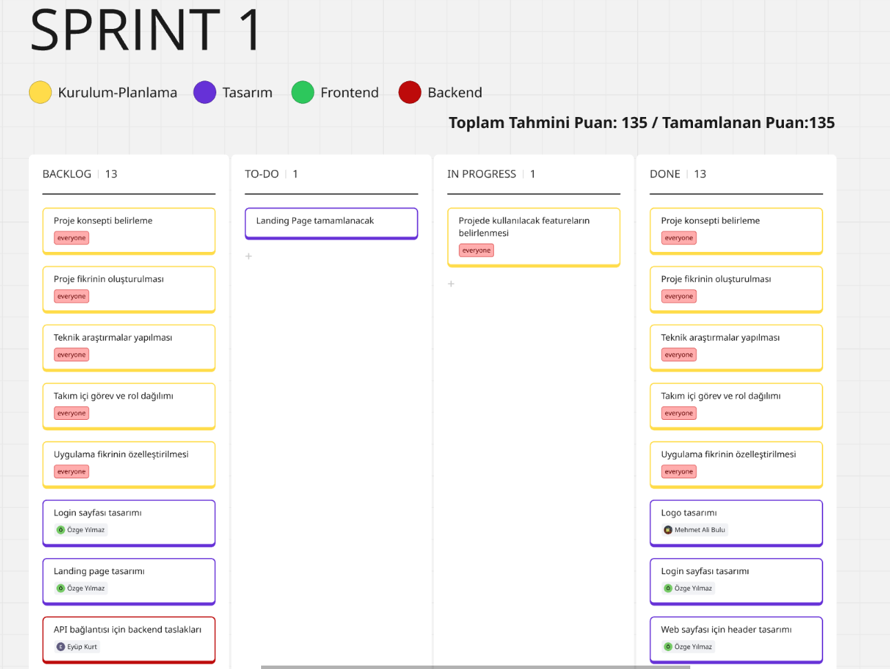  
   <strong>Sprint Board 1 </strong>

  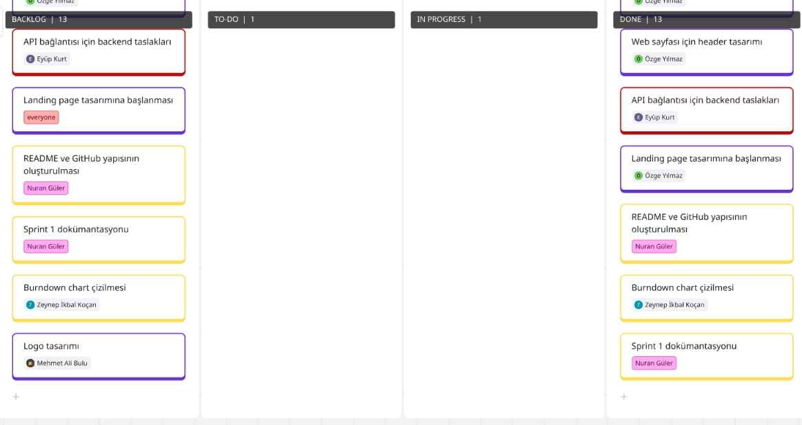  
   <strong>Sprint Board (Devamı) </strong>

  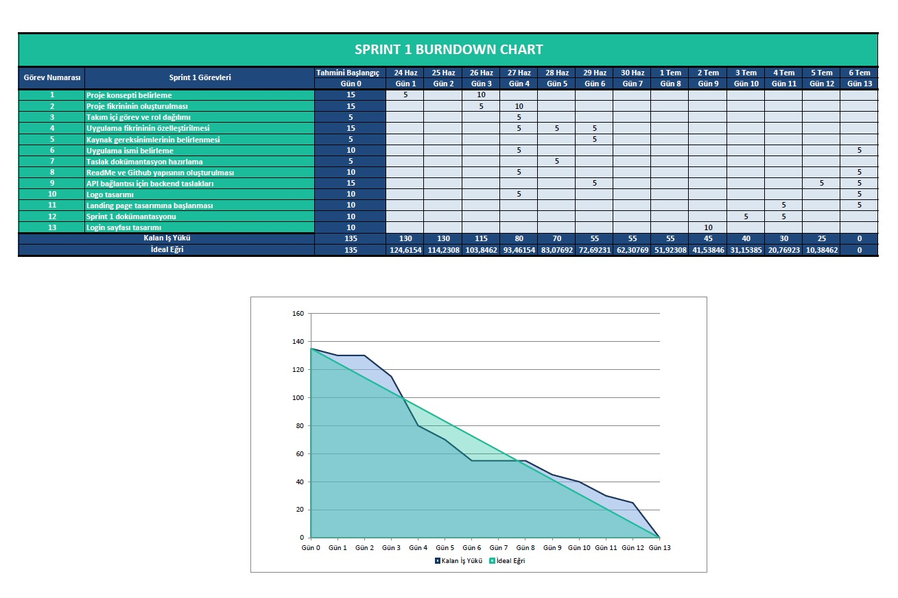  
   <strong>Burndown Chart</strong>

    
   <strong>Home Page</strong>

    
   <strong>Login Page</strong>

---

### Daily Scrum

**Sprint 1 Günlük İş Takibi**

| Gün | Tarih       | Yapılan İşler                                                   | Tamamlanan Görev(ler)                                               | Puan |
|-----|-------------|------------------------------------------------------------------|----------------------------------------------------------------------|------|
| 1   | 24.06.2025  | Sprint başlatıldı, proje konsepti oluşturuldu                   | Proje konsepti belirleme                                            | 15   |
| 2   | 25.06.2025  | Ana fikir netleştirildi, problem tanımı yazıldı                 | Proje fikrinin oluşturulması                                        | 15   |
| 3   | 26.06.2025  | Rol dağılımları yapıldı, görev paylaşımı netleşti               | Takım içi görev ve rol dağılımı                                     | 15   |
| 4   | 27.06.2025  | Uygulama özelleştirildi, teknik araştırmalara başlandı          | Uygulama fikrinin özelleştirilmesi + Teknik araştırma (kısmen)     | 10   |
| 5   | 28.06.2025  | Teknik araştırma tamamlandı                                     | Teknik araştırmaların tamamı                                       | 10   |
| 6   | 29.06.2025  | Logo çizildi, GitHub yapısı oluşturuldu                         | Logo tasarımı + README & GitHub yapısı                             | 10   |
| 7   | 30.06.2025  | Dokümantasyon taslağı hazırlandı                                | Taslak dokümantasyon                                               | 10   |
| 8   | 01.07.2025  | Backend API bağlantısı taslaklandı                              | API bağlantısı backend taslakları                                  | 5    |
| 9   | 02.07.2025  | Login sayfası Figma’da tasarlandı                               | Login sayfası tasarımı                                             | 5    |
| 10  | 03.07.2025  | Header tasarımı tamamlandı                                      | Web sayfası header tasarımı                                        | 5    |
| 11  | 04.07.2025  | Burndown chart çizildi, sprint dokümantasyonu yapıldı           | Chart + Sprint 1 dökümanı                                          | 10   |
| 12  | 05.07.2025  | Landing page tasarımı başlatıldı                                | Landing page tasarımına başlanması                                 | 5    |
| 13  | 06.07.2025  | Feature listesi çıkarıldı, sprint sonlandırıldı                 | Feature listesi (in progress)                                      | 5    |

**Toplam Puan:** 135

  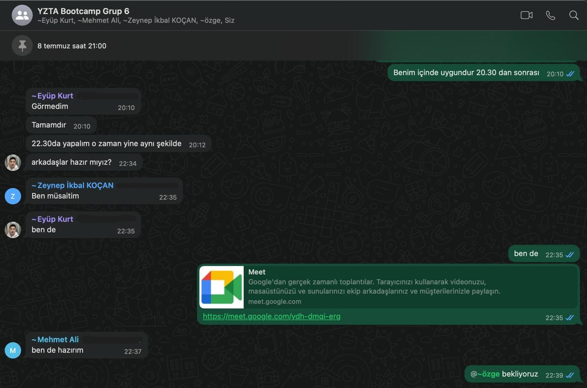  
   <strong>WhatsApp Chat</strong>

  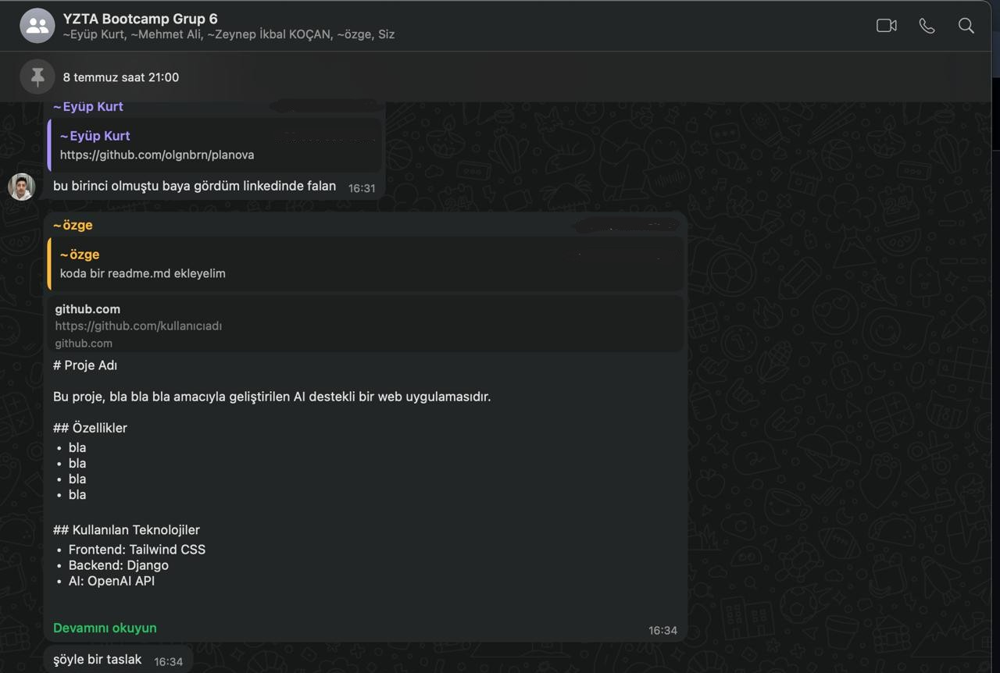  
   <strong>WhatsApp Chat</strong>

- UI tasarımlarında Figma kullanılmasına karar verildi.
- Proje yönetim aracı olarak Miro kullanılmasına karar verildi.
- Günlük scrum toplantıları, takımın müsaitlik durumuna göre WhatsApp ve Google Meets üzerinden gerçekleştirildi.
- Giriş sistemi için E-posta kullanılmasına karar verildi.

---

### Sprint Retrospektive

**Neler iyi gitti?**

• Takım içi iletişim güçlüydü: Fikir alışverişleri hızlı ve verimliydi, herkes birbirine destek oldu.  
• Roller netti, görev dağılımı oturdu: Herkes kendi sorumluluk alanını biliyordu ve bu, işlerin düzenli ilerlemesini sağladı.  
• Teknik araştırma süreci çok verimli geçti: Django, yapay zeka entegrasyonu ve frontend teknolojileri hakkında önemli bilgiler edindik, bu da sonraki adımlar için sağlam bir temel oluşturdu.

**Neler geliştirilmeli?**

• **Yapay Zeka Egzersizlerinin Kalitesi ve Çeşitliliği:** Belirlenen 4 zihinsel problem ile uyum daha iyi analiz edilmeli.  
• **Kullanıcı Geri Bildirim Mekanizması:** Geri bildirim toplayacak mekanizmalar entegre edilmeli.  
• **Frontend Kullanıcı Deneyimi (UX):** Web uyumluluk ve sezgisel arayüz gözden geçirilmeli.  
• **Hata Ayıklama ve Test Süreçleri:** Yapay zekâ ile backend etkileşimleri için sistematik test yapısı kurulmalı.  
• **Teknik Borç Yönetimi:** Kod tekrarları azaltılmalı, kod açıklamaları ve yorumlar düzenli hâle getirilmeli.

**Bir sonraki sprintte:**

• Zaman yönetimi iyileştirilecek, tahminler daha gerçekçi yapılacak.  
• MVP için her zihinsel problem alanına ait 2 egzersiz tamamlanacak.  
• Kullanıcı geri bildirim sistemi entegre edilecek.

# Sprint 2

  
<strong>Detayları Görüntüle</strong>

### Sprint 2 Bilgileri
- Sprint Başlangıç Tarihi: 08.07.2025  
- Sprint Bitiş Tarihi: 20.07.2025  
- Sprint Süresi: 12 Gün 
- Takım: Brain Team 6

  Puan Tamamlama Mantığı:
  **2. Sprint**: Kodlama, API entegrasyonu ve temel işlevlerin geliştirilmesi için **480 puan** hedeflenmektedir.

  

### Sprint 2 Review Görselleri

  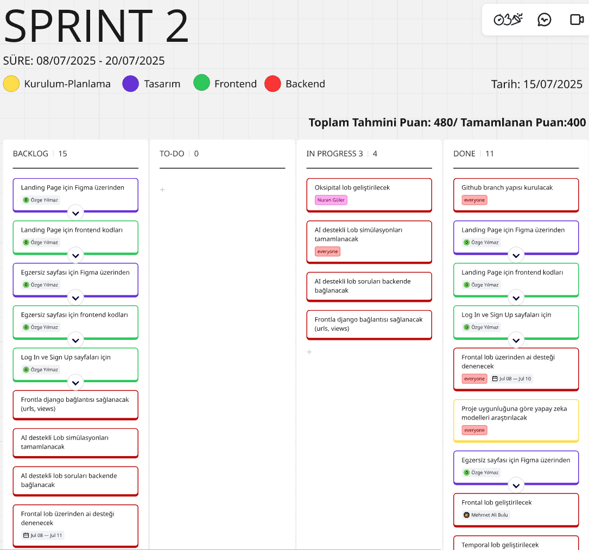  
   <strong>Sprint Board 2.1 </strong>

  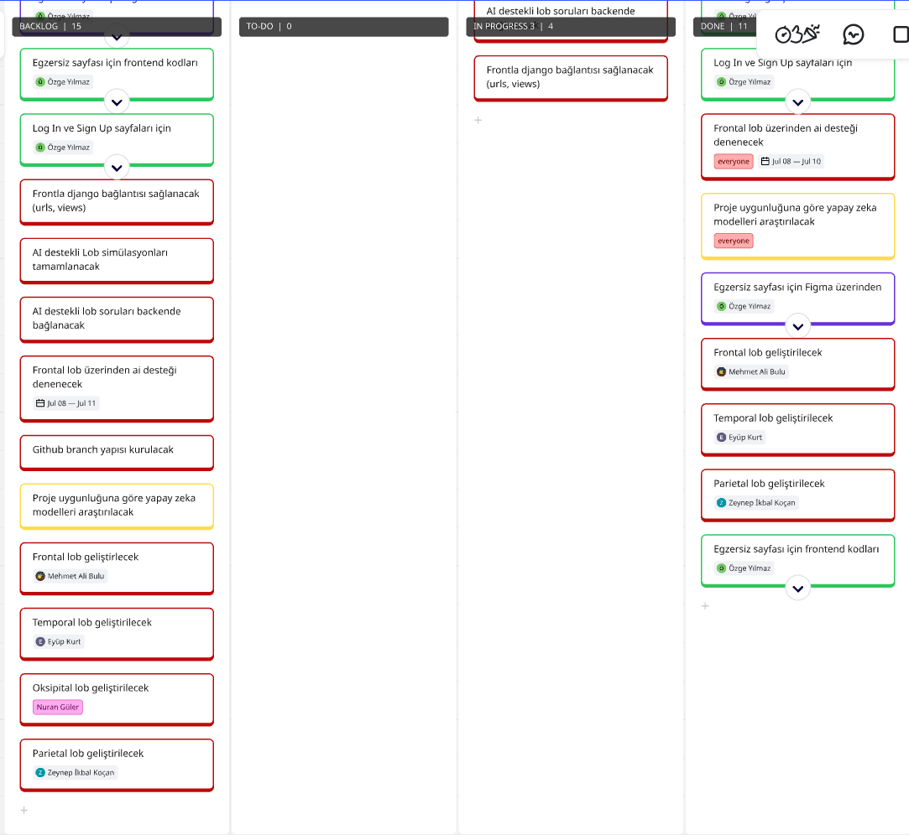  
   <strong>Sprint Board 2.2 </strong>

  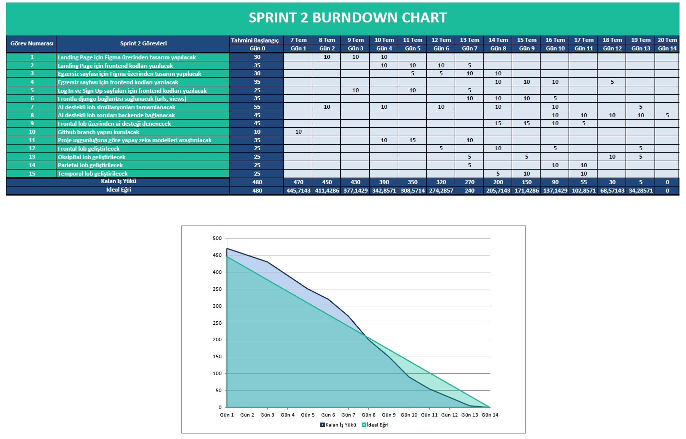  
   <strong>Burndown Chart</strong>

  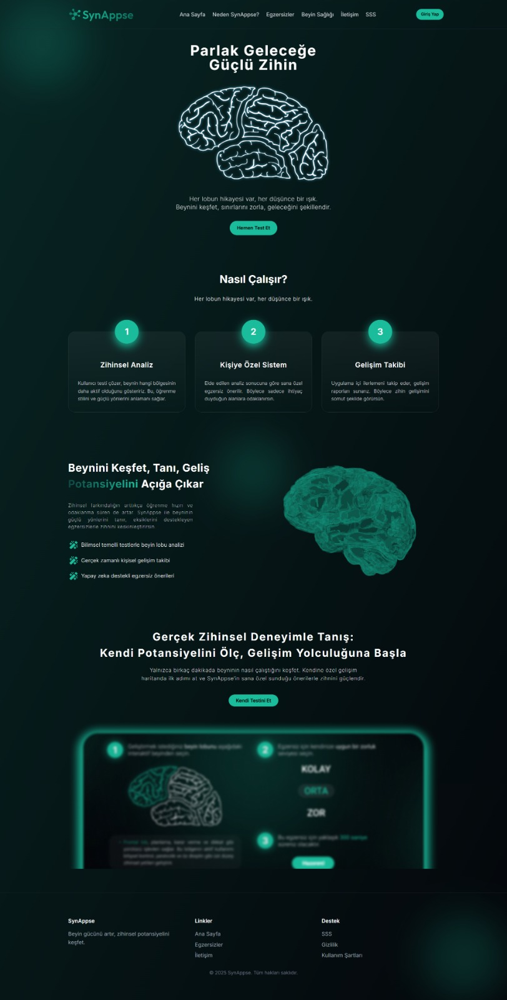  
   <strong>Landing Page</strong>

  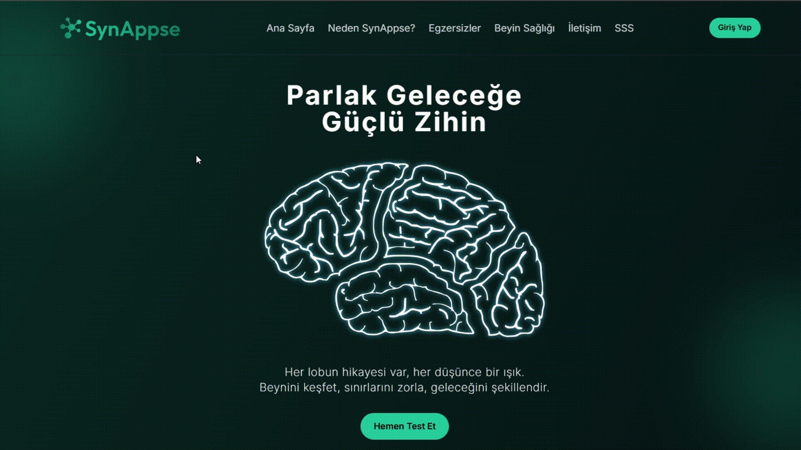  
   <strong>Landing Page GIF</strong>

    
   <strong>Egzersiz Seçim Sayfası</strong>

  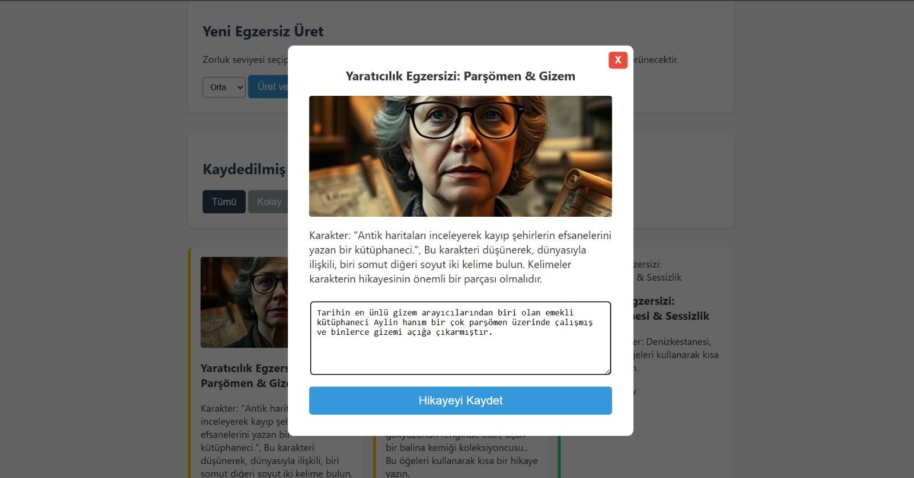  
   <strong>Yaratıcılık Egzerzisi Demo</strong>

  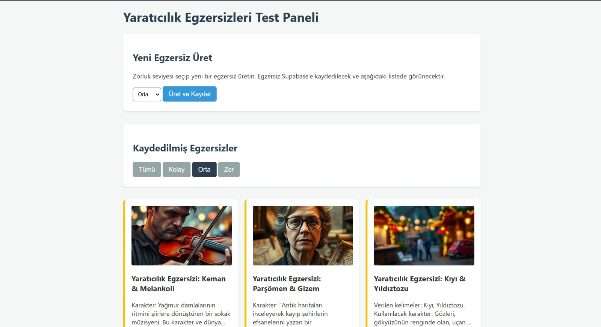  
   <strong>Yaratıcılık Egzersizi Paneli demo</strong>

  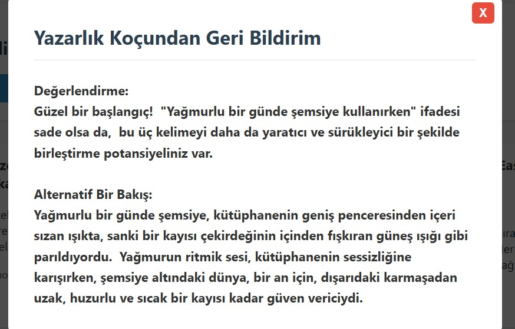  
   <strong>Egzersiz Sonrası AI Feedback Demo</strong>

  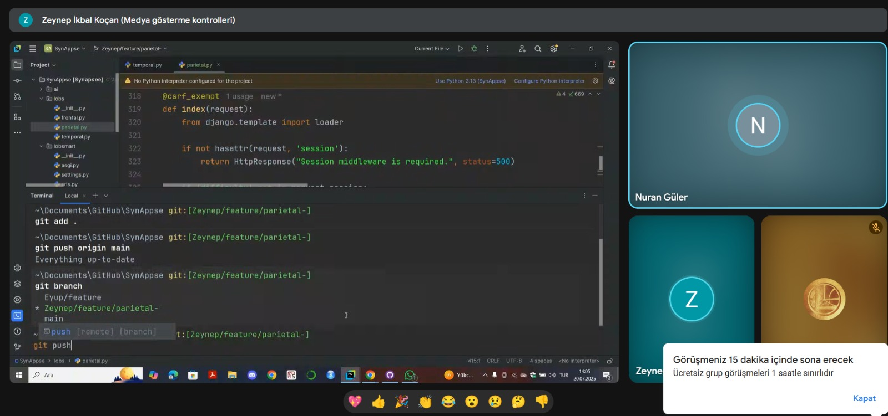  
   <strong>Yapılan Görüşmeler</strong>

---

**Sprint 2 Günlük İş Takibi**

| Gün | Tarih       | Yapılan İşler                                                   | Tamamlanan Görev(ler)                                               | Puan |
|-----|-------------|------------------------------------------------------------------|----------------------------------------------------------------------|------|
| 1   | 07.07.2025  | Landing page Figma tasarımına başlandı ve ilk taslaklar oluşturuldu | -                                                                   | 10   |
| 2   | 08.07.2025  | Tasarım ilerletildi, landing page frontend kodlamasına geçildi  | -                                                                   | 20   |
| 3   | 09.07.2025  | Landing page kodlama devam etti, egzersiz sayfası tasarımı başlatıldı | -                                                               | 20   |
| 4   | 10.07.2025  | Egzersiz sayfası tasarımı tamamlandı, kodlamaya geçildi         | Landing page tasarımı + kodlama                                    | 30   |
| 5   | 11.07.2025  | Egzersiz sayfası kodlaması yapıldı, login/sign up sayfaları tasarlandı | Egzersiz sayfası tasarımı + kodlama                           | 30   |
| 6   | 12.07.2025  | Login/sign up frontend kodlama ve Django bağlantısı sağlandı    | Login & Sign up kodlama + backend bağlantısı                       | 30   |
| 7   | 13.07.2025  | AI destekli lob simülasyonu başlatıldı, temel işlevler oluşturuldu | AI destekli lob simülasyon taslağı                               | 30   |
| 8   | 14.07.2025  | AI destekli lob soruları backend'e bağlandı ve test edildi      | Backend bağlantısı + test                                          | 40   |
| 9   | 15.07.2025  | Frontal lob testleri yapıldı, GitHub branch yapısı kuruldu      | Frontal lob testi + GitHub branch yapısı                          | 40   |
| 10  | 16.07.2025  | Yapay zeka modeli araştırması yapıldı, frontal lob geliştirildi | Proje uyumluluğu araştırması + frontal lob geliştirme             | 40   |
| 11  | 17.07.2025  | Oksipital ve parietal loblar geliştirildi                       | Oksipital + parietal lob                                          | 40   |
| 12  | 18.07.2025  | Temporal lob geliştirildi, son testler yapıldı                  | Temporal lob                                                       | 30   |
| 13  | 19.07.2025  | Son kontroller ve eksik işler tamamlandı                        | Kalan küçük görevler                                              | 30   |
| 14  | 20.07.2025  | Sprint 2 raporu ve dokümantasyonu hazırlandı                    | Sprint kapanışı + raporlama                                       | 10   |

**Toplam Puan:** 400

### Sprint Retrospektive

**Neler iyi gitti?**

• Planlanan her gün Google Meet'de buluşuldu, asla aksama olmadı.  
• Takım üyelerinin meşguliyetlerine göre görev dağılımı iyi yapıldı, herkes görevini yerine getirdi.
• Proje geliştirme aşamasında kullanılan teknolojileri daha önce kullanmayan takım arkadaşlarının öğrenme süreci iyi geçti, hızlı bir şekilde adapte oldular.

**Neler geliştirilmeli?**

• **Yapay Zeka'dan Alınan Geri Dönüşler:** Promptlar üzerine daha fazla düşünülmeli ve iyi bir fine tuning yapılmalı.  
• **Geliştirme Hızı:** Sprint 3'e girerken geliştirme hızı en üst seviyeye çıkarılmalı.  
• **Geliştirme Planlaması** Projenin kalan geliştirme kısımları iyi bir şekilde adımlara bölünmeli ve planlanmalı.   
• **Teknik Borç Yönetimi:** Kod satırları düzenlemeli ve clean code prosedürlerinin uygulandığından emin olunmalı.

**Bir sonraki sprintte:**

• Ekip görevlendirilmesi çok net yapılacak.  
• Lob isimlendirilmesinden vazgeçilip, egzersiz isimlendirilmesine geçilecek.  
• Yapay zekadan alınan yanıtların iyileştirilmesi için detaylı araştırmalar yapılacak.
• Backend ve Frontend birleştirilecek.

# Sprint 3

  
<strong>Detayları Görüntüle</strong>

 
Geliştirme ilerledikçe güncellenecektir.

  

# Proje Tanıtım Videosu  
Video ve demo bağlantıları proje tamamlandığında burada paylaşılacaktır.

# Proje Linki  
Projenin canlı adresi veya kaynak kodu bağlantısı tamamlandığında burada yer alacaktır.

# Kullanılan Teknolojiler  

  
<strong>Detayları Görüntüle</strong>

| **Katman**        | **Teknoloji**                               |
|-------------------|--------------------------------------------|
| **Frontend**      |  |
| **Backend**       |  |
| **API / Yapay Zekâ** |  |
| **Veritabanı**    |  |

> **Not:** Proje tamamlandığında kullanılan tüm teknolojiler bu bölümde güncellenerek detaylı şekilde listelenecektir.

