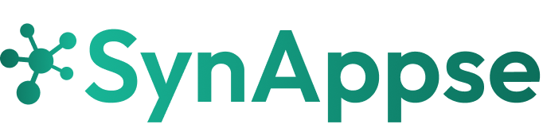
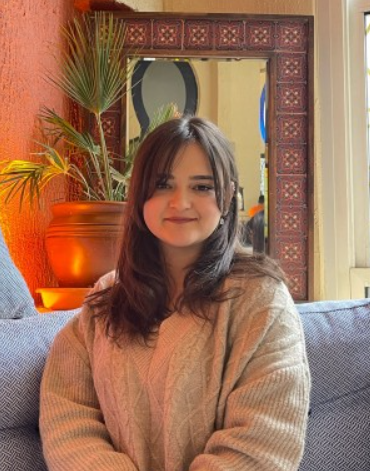
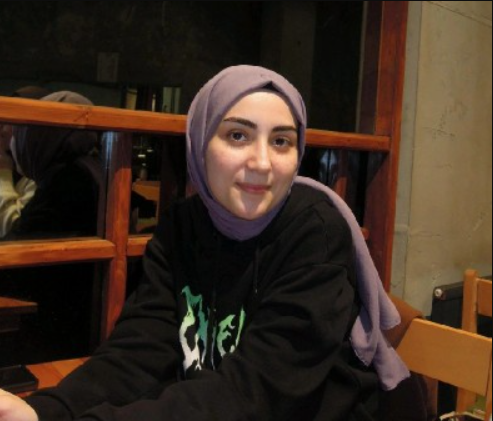
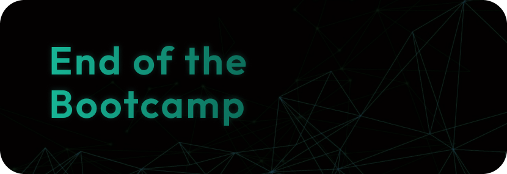
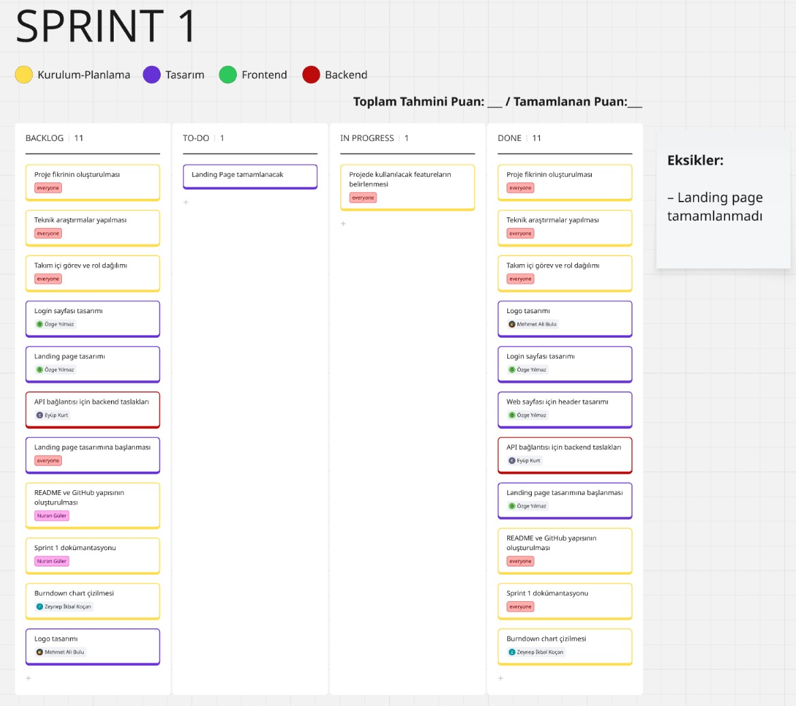
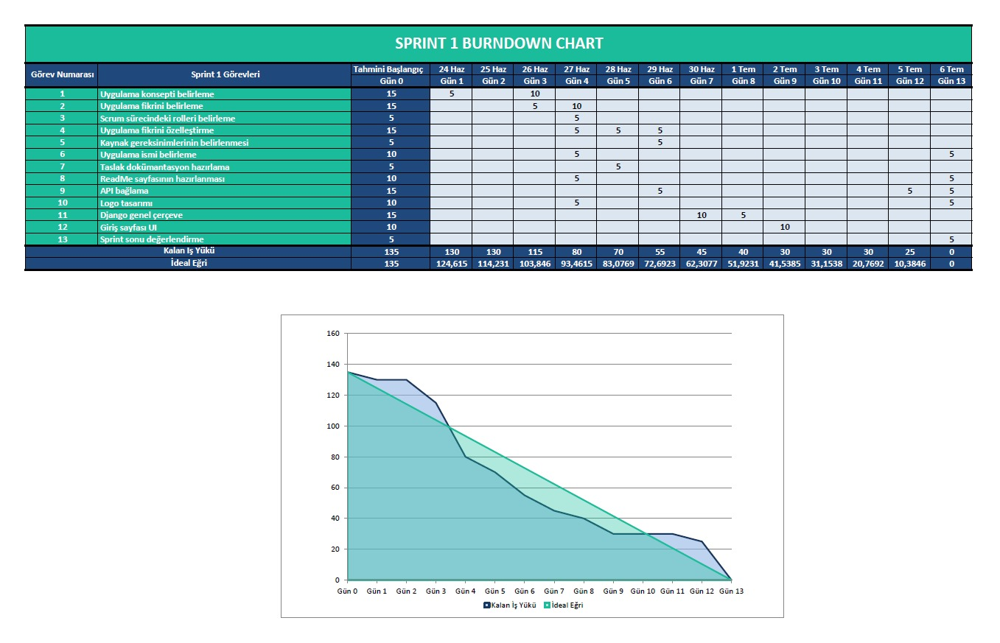
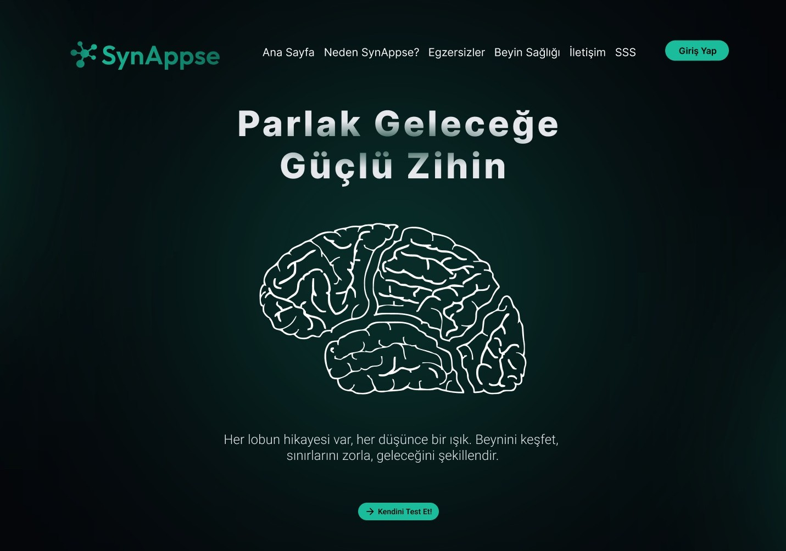
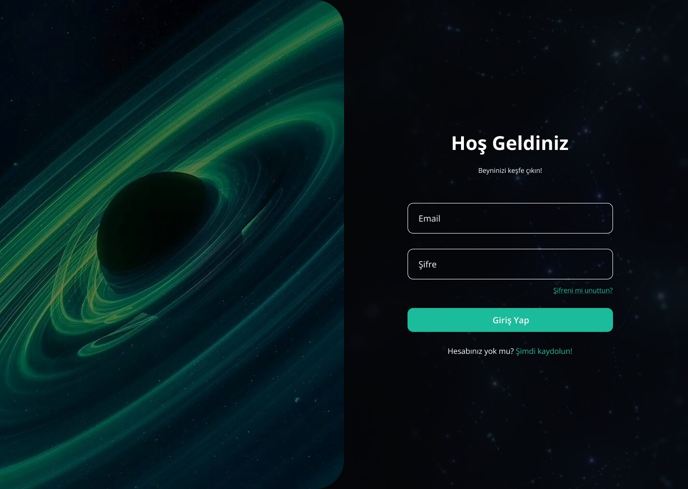

  

# Takım İsmi 

Brain Team 6

---

# Katkıda Bulunanlar

| Resim | Ad Soyad | Görev | GitHub | Linkedin |
| --- | --- | --- | --- | --- |
|  | Mehmet Ali BULU | Product Owner | https://github.com/malicup | https://www.linkedin.com/in/mehmet-ali-bulu-3b0869257/ |
|  | Nuran GÜLER | Scrum Master | https://github.com/nrnglr | https://www.linkedin.com/in/nuran-güler-3439a0262/ |
|  | Eyüp KURT | Developer | https://github.com/Eeyupkurtt | https://www.linkedin.com/in/eyupkurt/ |
|  | Özge YILMAZ | Developer | https://github.com/ozgeylmash | https://www.linkedin.com/in/ozge-yillmaz/ |
|  | Zeynep İkbal KOÇAN | Developer | https://github.com/ZiynepP | https://www.linkedin.com/in/zeynep-ikbal-ko%C3%A7an-849b4a199/ |

---

# Uygulama Açıklaması

SynAppse, kullanıcıların beyin lobları üzerinde bilinçli seçimler yaparak zihinsel egzersizler gerçekleştirdiği, yapay zekâ destekli etkileşimli bir web uygulamasıdır. Uygulama, her bir beyin lobuna özel olarak tasarlanmış bilişsel görevlerle kullanıcıya odaklı bir deneyim sunar.

Her lob (frontal, parietal, temporal, oksipital) belirli bir bilişsel yetiyle ilişkilendirilir:

Frontal lob için eleştirel düşünme ve karar verme,

Parietal lob için dikkat ve problem çözme,

Temporal lob için hafıza ve dil,

Oksipital lob için görsel analiz görevleri sunulur.

Yapay zekâ, her gün kullanıcıya özel görevler ve senaryolar üretir; içerikler sabit promptlara değil, sürekli öğrenen bir sisteme dayanır. Böylece kullanıcı, kendi bilişsel kapasitesini keşfederken aynı zamanda onu bilinçli biçimde geliştirme fırsatı bulur.

Synapse, zihinsel performansı artırmayı hedefleyen bilim temelli, kişiselleştirilmiş bir egzersiz platformudur.
Vizyon: Yapay zeka çağında, insan bilişselliğini ve entelektüel bağımsızlığını koruyan ve güçlendiren bir numaralı dijital zihin sağlığı platformu olmak.

---

# Vizyon ve Misyon

  
<strong>Detayları Görüntüle</strong>

**Vizyon:**  
Yapay zeka çağında, insan bilişselliğini ve entelektüel bağımsızlığını koruyan ve güçlendiren bir numaralı dijital zihin sağlığı platformu olmak.

**Misyon:**  
Üretken yapay zeka araçlarının yaygın kullanımının getirdiği potansiyel bilişsel zayıflıkları ("Bilişsel Borçlanma"), hedeflenmiş, bilimsel temelli ve etkileşimi yüksek günlük zihinsel antrenmanlarla gidermek.

---

# Hedef Kitle

  
<strong>Detayları Görüntüle</strong>

- Öğrenciler  
- Eğitimciler, psikologlar ve psikiyatristler  
- Oyunlaştırılmış öğrenme ortamı arayan kullanıcılar  
- Beyin egzersizi yapmak isteyen bireyler  

---

# Nasıl Çalışır?

  
<strong>Detayları Görüntüle</strong>

1. **Etkileşimli Arayüz:**  
    Uygulama, loblara ayrılmış bir beyin haritası sunar. Kullanıcı, bu harita üzerinde dilediği lobu seçerek yolculuğuna başlar.

2. **Lob Seçimi:**  
    Frontal, Parietal, Temporal veya Oksipital loblardan biri seçilir. Her lob, farklı bilişsel becerileri temsil eder (örneğin frontal: karar verme, temporal: hafıza).

3. **Yapay Zekâ Destekli Egzersiz:**  
    Seçilen loba özel olarak oluşturulmuş bilişsel görevler, yapay zekâ tarafından sunulur. Görevler; hafıza, mantık, dikkat, görsel-işitsel işlemleme gibi yetenekleri çalıştırır.

4. **Zaman Takibi ve Odak Ölçümü:**  
    Görev süresince kullanıcının yanıt süresi, dikkat süresi ve tepki hızı izlenir. Bu veriler, bireyin bilişsel performansını daha hassas analiz etmeye yardımcı olur.

5. **Nöro-Bilgilendirme:**  
    Her görev öncesinde, seçilen lobun işleviyle ilgili kısa bilimsel bilgiler sunulur.  
    *“Frontal lob planlama ve karar verme süreçlerini yönetir. Bugünkü egzersiziniz bu becerileri hedef alacak.”*

6. **Geribildirim ve Değerlendirme:**  
    Görev sonunda yapay zekâ, performansı analiz ederek puanlama ve geri bildirim sunar. Kullanıcı, hangi alanda güçlü olduğunu veya zorlandığını doğrudan görebilir.

7. **Gelişim Takibi Paneli:**  
    Kullanıcıya özel gösterge paneli ile lob bazlı gelişim grafiklerle sunulur. Zaman içinde hangi becerilerde nasıl bir ilerleme kaydedildiği takip edilebilir.

8. **Günlük Görev / Lob Döngüsü:**  
    Her gün farklı bir beyin lobuna odaklanacak şekilde görev önerisi yapılır. Bu sistematik yapı, nöroplastisiteyi destekleyen dengeli bir egzersiz planı sunar.

9. **Yapay Zekâ Destekli Tavsiyeler:**  
    AI, geçmiş görev performanslarına göre kullanıcılara kişiselleştirilmiş egzersiz önerilerinde bulunur.  
    Örnek: *“Bu hafta parietal lob performansınızda düşüş gözlemlendi, odaklanmanızı öneriyoruz.”*

---

# İlham Kaynağı

  
<strong>Detayları Görüntüle</strong>

Projemiz, MIT Media Lab tarafından yürütülen **"Your Brain on ChatGPT: Accumulation of Cognitive Debt..."** başlıklı akademik çalışmanın bulgularını temel almaktadır. Bu çalışma, YZ asistanlarının kullanımının kısa vadede bilişsel yükü azaltsa da, uzun vadede ciddi bilişsel maliyetler yarattığını ortaya koymuştur. Biz bu temel sorunu **"Bilişsel Borçlanma"** olarak adlandırıyoruz.

### Bilişsel borçlanmanın temel belirtileri ve hedeflediğimiz problemler şunlardır:

1. **Eleştirel Düşünme ve Problem Çözme Becerilerinde Azalma:** YZ'nin sunduğu hazır, sentezlenmiş ve tekil cevaplar, beynin karmaşık sorunları analiz etme, farklı bakış açılarını değerlendirme, argümanlardaki hataları tespit etme ve özgün çözümler üretme yeteneğini zayıflatır.  
2. **Hafıza Zayıflığı ve Yüzeysel Öğrenme:** Bilgiyi araştırma, anlama ve kendi kelimelerimizle yeniden yapılandırma süreci, bilginin kalıcı hafızaya kaydedilmesini sağlar. YZ bu süreci atlayarak bilgiyi doğrudan sunduğunda, öğrenme ve hatırlama süreçleri yüzeyselleşir. Çalışma, YZ kullananların yazdıkları metinlerden dakikalar sonra bile alıntı yapamadığını göstermiştir.  
3. **Yaratıcılık ve Özgün Düşüncenin Körelmesi:** Çalışmanın EEG verileri, YZ kullanımının beynin yaratıcılıkla ilişkili sinirsel ağlarının daha az aktif olmasına neden olduğunu göstermektedir. YZ'nin genellikle en "olasılıklı" ve tahmin edilebilir çıktıları üretmesi, zamanla kalıpların dışında düşünme (divergent thinking) yeteneğimizi köreltebilir.  
4. **Bağımsız Karar Verme Yeteneğinde Gerileme:** Beynin planlama, organizasyon, izleme ve karar verme gibi yürütücü işlevlerle (executive functions) ilgili bölgeleri, YZ kullanımıyla daha az aktif hale gelir. Bu durum, gelecekte YZ olmadan bir görevi baştan sona planlama ve yönetme konusunda zorluklar yaşanmasına neden olabilir.

Kaynak: [Your Brain on ChatGPT: Accumulation of Cognitive Debt | MIT](https://arxiv.org/pdf/2506.08872v1)

---

  

# Sprint 1
 

  
<strong>Detayları Görüntüle</strong>

- Sprint Başlangıç Tarihi: 18.06.2025
- Sprint Bitiş Tarihi: 06.07.2025
- Sprint Süresi:
- Takım: AI Grup 6

  

  

  

  

 
Sprint 1 Retrospektifi

Neler iyi gitti?

• Takım içi iletişim güçlüydü: Fikir alışverişleri hızlı ve verimliydi, herkes birbirine destek oldu.
• Roller netti, görev dağılımı oturdu: Herkes kendi sorumluluk alanını biliyordu ve bu, işlerin düzenli ilerlemesini sağladı.
• Teknik araştırma süreci çok verimli geçti: Django, yapay zeka entegrasyonu ve frontend teknolojileri hakkında önemli bilgiler edindik, bu da sonraki adımlar için sağlam bir temel oluşturdu.
Neler geliştirilmeli?

• Yapay Zeka Egzersizlerinin Kalitesi ve Çeşitliliği: Oluşturulan "günün egzersizi" içeriklerinin, belirlenen 4 zihinsel problem (eleştirel düşünme, hafıza, yaratıcılık, bağımsız karar verme) ile ne kadar uyumlu olduğunu daha iyi değerlendirmeliyiz. Belki bazı egzersizler beklenen etkiyi yaratmadı veya yeterince çeşitli değildi. Prompt mühendisliği konusunda daha fazla deneme yapabiliriz.
• Kullanıcı Geri Bildirim Mekanizması: Egzersizler hakkında kullanıcı geri bildirimlerini (örneğin, egzersizin zorluğu, faydası, anlaşılırlığı) toplayacak basit bir sistem henüz entegre edilmedi. Bu, egzersizleri iyileştirmek için kritik.
• Frontend Kullanıcı Deneyimi (UX): HTML/CSS tarafında, özellikle mobil uyumluluk ve arayüzün akıcılığı konusunda bazı küçük pürüzler olabilir. Kullanıcıların egzersizlere kolayca eriştiğinden ve arayüzün sezgisel olduğundan emin olmalıyız.
• Hata Ayıklama ve Test Süreçleri: Özellikle yapay zeka entegrasyonu ve Django backend'i arasındaki etkileşimlerde ortaya çıkan hataları daha hızlı tespit etmek ve çözmek için standart bir hata ayıklama ve test stratejisi geliştirmeliyiz.
• Teknik Borç Yönetimi: Hızlı ilerlerken farkında olmadan biriken küçük teknik borçlar (örneğin, kod tekrarı, yetersiz yorumlama) olabilir. Bunları düzenli olarak gözden geçirip ele almak, gelecekteki geliştirmeleri kolaylaştıracaktır.
Bir sonraki sprintte:

• Zaman yönetimine daha dikkat: Özellikle yapay zeka prompt mühendisliği ve frontend arayüz geliştirmeleri için tahmini süreleri daha gerçekçi belirleyip, günlük ilerlemeyi daha sık takip ederek olası sapmaları erken fark etmek.
• Minimum Viable Product (MVP) için temel yapay zeka egzersiz setini tamamlamak: Her bir zihinsel problem alanı için en az 2 farklı egzersiz tipini çalışır hale getirmek ve kullanıcı geri bildirim mekanizmasının ilk versiyonunu entegre etmek.

---

# Sprint 2

  
<strong>Detayları Görüntüle</strong>

Süreçte eklenecek…

---

# Sprint 3

  
<strong>Detayları Görüntüle</strong>

    Süreçte eklenecek…

---

  

# Detaylar

  
<strong>Detayları Görüntüle</strong>

| **Katman** | **Teknoloji** |
| --- | --- |
| **Frontend** | HTML5, Tailwind CSS, Vanilla JavaScript, Alpine.js |
| **Backend** | Python 3.11+, Django 4.x, Django REST Framework |
| **API/Yapay Zekâ** | Gemini AI API |
| **Veritabanı** | SQLite 3 |

---

  
<strong>Uygulama Video Linki</strong>

    --Video Linki--

---

  
<strong>Uygulama URL</strong>

    --url--

---
