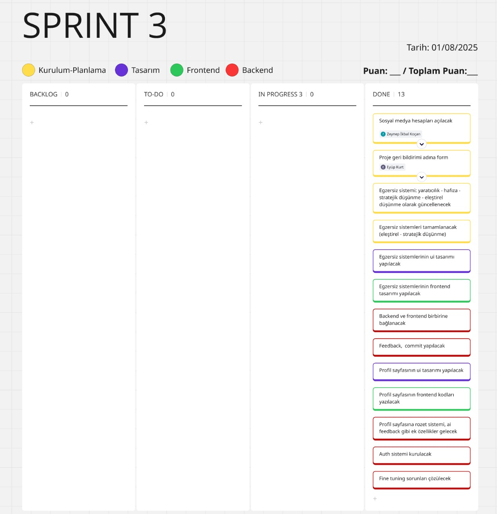
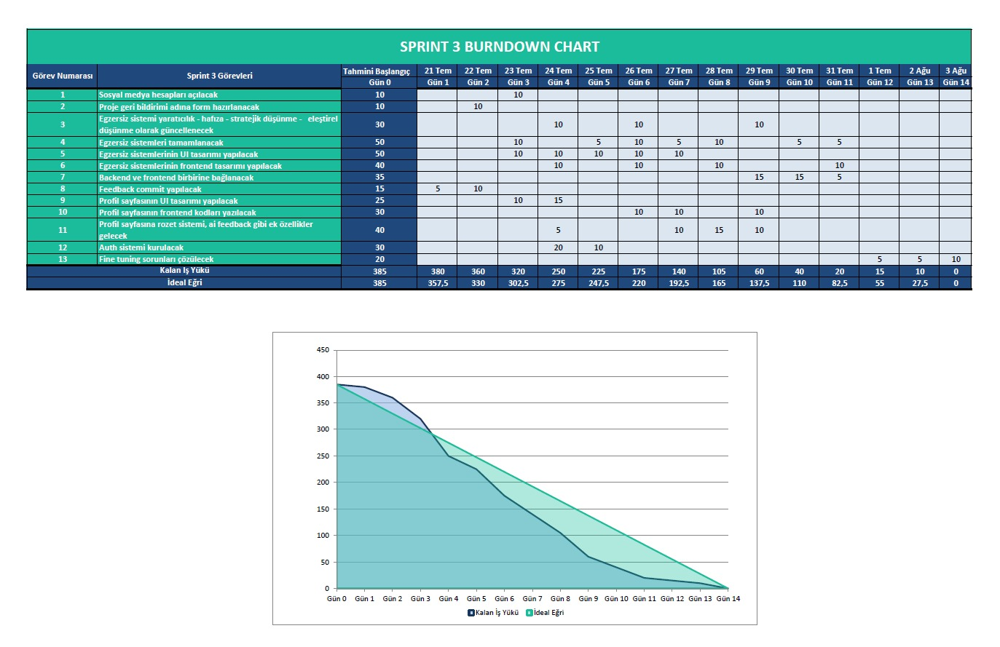
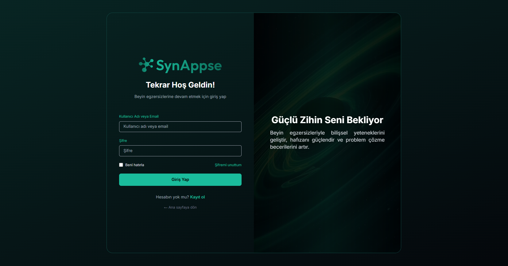
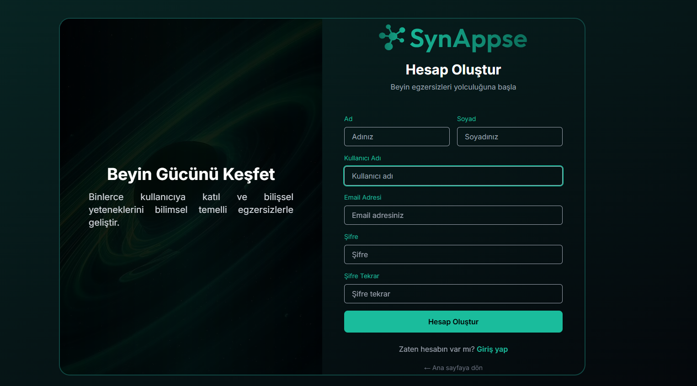
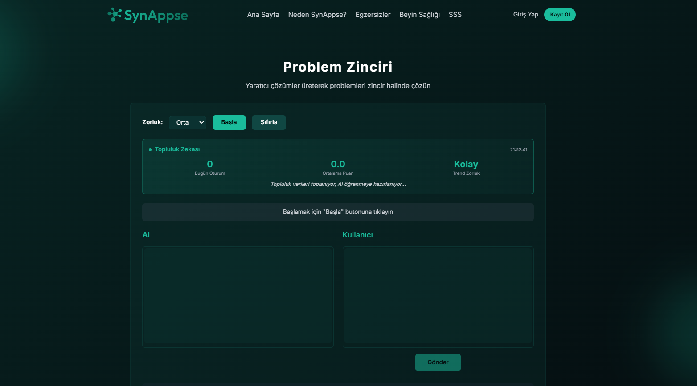
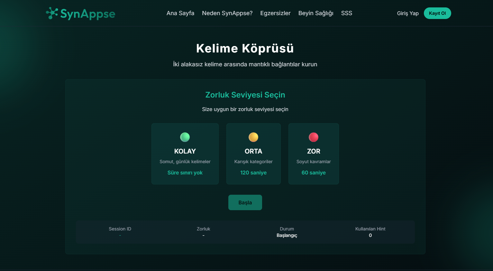
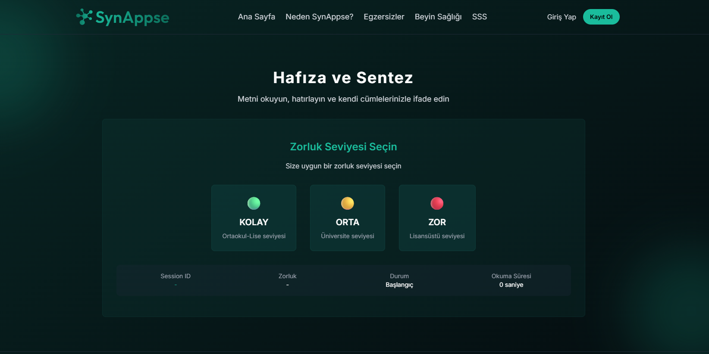

  

# Takım İsmi 

Brain Team 6

# Katkıda Bulunanlar

| Resim | Ad Soyad | Görev | GitHub | Linkedin |
| --- | --- | --- | --- | --- |
|  | Mehmet Ali BULU | Product Owner | https://github.com/malicup | https://www.linkedin.com/in/mehmet-ali-bulu-3b0869257/ |
|  | Nuran GÜLER | Scrum Master | https://github.com/nrnglr | https://www.linkedin.com/in/nuran-güler-3439a0262/ |
|  | Eyüp KURT | Developer | https://github.com/Eeyupkurtt | https://www.linkedin.com/in/eyupkurt/ |
|  | Özge YILMAZ | Developer | https://github.com/ozgeylmash | https://www.linkedin.com/in/ozge-yillmaz/ |
|  | Zeynep İkbal KOÇAN | Developer | https://github.com/ZiynepP | https://www.linkedin.com/in/zeynep-ikbal-ko%C3%A7an-849b4a199/ |

# Uygulama Açıklaması

**SynAppse**, yapay zeka destekli, etkileşimli bir web uygulamasıdır. Kullanıcıların "yapay zekalaşan" dünyanın sebep olduğu bilişsel yükü hafifletmeleri ve bilinçsiz büyük dil modeli (LLM) etkileşimlerinin zihinsel beceriler üzerindeki olumsuz etkilerine karşı zihinlerini formda tutabilmeleri için geliştirilmiştir. Modern yapay zekâ araçlarının bilinçsiz kullanımının sebep olabileceği eleştirel düşünme, hafıza, yaratıcılık ve bağımsız karar verme gibi alanlardaki olası zayıflamalara karşı, günlük egzersizler ve kişiselleştirilmiş geri bildirimler sunar.

**Synappse**'ın ortaya çıkma motivasyonu MIT tarafından hazırlanan ve 10 Temmuz 2025 tarihinde yayınlanan [**Your Brain on ChatGPT: Accumulation of Cognitive Debt when Using an AI Assistant for Essay Writing Task**](https://arxiv.org/pdf/2506.08872) başlıklı bilimsel araştırmadır.

**Synappse**'deki her egzersiz bu bilimsel araştırmada bilinçsiz büyük dil modeli kullanımı sonucunda ortaya çıkan **eleştirel düşünme**, **hafıza**, **yaratıcılık** becerilerindeki gerilemeyi hedef alır. **Kullanıcıdan beklenti**, günlük üç egzersize de toplam 15 dakika gibi kısa bir süre ayırması ve zihnini diri tutmasıdır. Çünkü biz Yapay Zeka'nın insanlar gibi düşünmesinden çok, insanların yapay zeka gibi düşünmesinden endişeleniyoruz.

## Synappse Egzersizleri

### Problem Zinciri
Kullanıcıya Yapay Zeka tarafından hazırlanmış açık uçlu, absürt bir problem verilir ve kullanıcıdan bu probleme bir çözüm üretmesi istenir. Yapay Zeka kullanıcının ürettiği sonucu aldıktan sonra bu çözümün yol açtığı başka bir problemi kullanıcıya iletir ve kullanıcıdan oluşan bu yeni probleme de çözüm bulması istenir. Bu döngü 5 tur devam eder ve en sonda kullanıcıya Yapay Zeka tarafından bir skorlama yapılır. Kullanıcı ayrıca "Topluluk Zekası" kısmından o gün Problem Zinciri yapanların ortalama skorunu görebilir. Kullanıcı verilen problemi egzersiz sonunda değerlendirir ve Yapay Zeka gelecek egzersizlerde kullanıcıların değerlendirme skorunu da göze alarak gelecek problemlerini iyileştirir. Ayrıca Yapay Zeka değerlendirmelerde yüksek skor almış kullanıcı cevaplarını da işleyerek kendi problem üretme mekanizmasını geliştirir.

### Kelime Zinciri
Kullanıcıya Yapay Zeka tarafından belirlenmiş ikisi birbirinden alakasız bir **hedef kelime** ve üç **başlangıç kelimesi** verilir. Kullanıcı üç başlangıç kelimesinden istediğini seçer ve yaratıcılığını kullanarak hedef kelimeye en fazla 6 adımda başlangıç kelimesinden itibaren çağrışım yapacak kelimelerle ulaşmasıdır. Kullanıcıya egzersiz sonunda Yapay Zeka tarafından skorlama ve değerlendirme verilir. Alternatif cevaplar gösterilir.

### Hafıza ve Sentez
Yapay Zeka kullanıcıya üç farklı konu gösterir ve birini seçmesini bekler. Seçilen konuda bilgilendirici kısa bir metin üretilir ve bu kullanıcıya verilir. Kullanıcıdan bu metni 60 saniye içinde okuması beklenir ve sonrasında kullanıcı bu metinden ne öğrendiğini, ne anladığını kısaca yazar. Kullanıcıdan metni iyice beynine işleyebilmesi için metinden 3 anahtar kelime istenir ve bir de metin ile ilgili soru sorması beklenir (kullanıcının sorusu metin ile alakalı her hangi bir soru olabilir ve tekrar yapay zeka tarafından cevaplanır). Egzersiz sonunda kullanıcıya skorlama ve değerlendirme verilir.

# Vizyon ve Misyon

  
<strong>Detayları Görüntüle</strong>

### Vizyon  
Yapay zeka çağında insan zihnini pasif bir kullanıcı olmaktan çıkarıp aktif bir üreticiye dönüştüren; bunu günlük bir alışkanlık haline getiren, bilişsel yetileri koruyan, geliştiren ve bireyin entelektüel bağımsızlığını sürdürülebilir kılan birinci öncelikli dijital zihin sağlığı platformu olmak.

### Misyon
Üretken yapay zekanın günlük yaşamdaki yaygın kullanımıyla ortaya çıkan “bilişsel borçlanma” riskine karşı, bilimsel temellere dayanan, hedef odaklı ve etkileşimli zihinsel egzersizlerle mücadele etmek. Kullanıcının eleştirel düşünme, hafıza, yaratıcılık ve karar verme gibi temel bilişsel yetilerini her gün küçük adımlarla, ama kalıcı biçimde güçlendirmek.

##  Hedef Personalar

  
<strong>Detayları Görüntüle</strong>

###  Dijital Çağın Çocukları (Örn: İlkokul/Ortaokul Çağı)

**Meslek/Durum**: İlkokul veya ortaokul öğrencileri.

**Motivasyon**: Öğrenmeyi eğlenceli hale getirmek, okul derslerinde daha başarılı olmak ve dijital araçları bilinçli kullanma alışkanlığı edinmek. Ebeveynleri, çocuklarının teknoloji bağımlılığının zihinsel becerilerini olumsuz etkilemesinden endişe duyuyor olabilir.

**Acı Noktaları**: Kolay bilgiye ulaşımın getirdiği ezbercilik, okuduğunu anlama ve yorumlamada zorlanma, dikkat dağınıklığı, yaratıcı oyun ve düşünme süreçlerinde azalma. Okul ödevlerinde veya günlük hayatta kendi başlarına çözüm üretmek yerine hemen internete veya yapay zekaya yönelme eğilimi.

**Synappse'den Beklentisi**: Eğlenceli ve oyunlaştırılmış mini egzersizler aracılığıyla problem çözme, hafıza ve yaratıcılık becerilerini geliştirmek. Günlük rutinlerine kolayca entegre edilebilecek, kısa ve dikkat çekici aktivitelerle zihinsel çevikliklerini artırmak. Ebeveynler için ise çocuklarının zihinsel gelişimini destekleyen, güvenli ve eğitici bir alternatif sunması. Kolay modun varlığı sayesinde, çocukların sıkılmadan ve zorlanmadan katılabilecekleri bir deneyim.

### Yaratıcı Profesyonel (Örn: Dijital Pazarlamacı, Yazılımcı vb.)

**Meslek**: İçerik üreticisi, pazarlama uzmanı, yazılımcı, tasarımcı, araştırmacı.

**Motivasyon**: İşlerinde özgün ve taze fikirler üretme yeteneğini korumak. YZ'nin sunduğu hazır çözümlerin kendi yaratıcı kıvılcımlarını sönümlemesinden endişe duyuyorlar. Günlük yoğun tempoda zihinlerini aktif tutacak pratik yollar arıyorlar.

**Acı Noktaları**: Yaratıcılık tıkanıklığı, rutin işlerde zihinsel yorgunluk, yeni fikirler üretmekte hissedilen pasiflik. YZ'ye olan bağımlılığın uzun vadede kendi özgün düşünce süreçlerini köreltebileceği endişesi.

**Synappse'den Beklentisi**: Güne başlarken veya gün içinde kısa molalarda zihinlerini canlandıracak, yaratıcı düşünme modunu tetikleyecek mini egzersizler. Küçük zorluklarla beyinlerini zinde tutarak, yaratıcı esnekliklerini sürdürme ve ani fikirler üretme kapasitelerini destekleme.

###  Odaklanma Arayan Öğrenci (Örn: Üniversite Öğrencisi, Uzaktan Eğitim Alan)  

**Meslek**: Üniversite öğrencisi, uzaktan eğitim öğrencisi, sınavlara hazırlanan.

**Motivasyon**: Bilgiyi daha iyi akılda tutmak, okuduklarını ve öğrendiklerini derinlemesine anlamak. YZ'nin özet çıkarma gibi kolaylıklarının, aslında bilgiyi işleme ve hatırlama süreçlerini yüzeyselleştirdiğini fark etmiş olabilirler. Odaklanma sorunları ve bilgiye yüzeysel yaklaşım konusunda endişeliler.

**Acı Noktaları**: Uzun süreli odaklanma zorluğu, okuduklarını kısa sürede unutma, bilgiyi kendi cümleleriyle yorumlamakta veya sentezlemekte zorlanma. Sınavlar ve projelerde YZ'ye aşırı güvenme sonucu kendi öğrenme kaslarının zayıfladığını hissetme.

**Synappse'den Beklentisi**: Hafızayı güçlendirmeye yönelik kısa, etkileşimli alıştırmalar. Bilgiyi daha iyi içselleştirmelerine yardımcı olacak, eleştirel okuma ve analiz becerilerini nazikçe geliştirecek günlük görevler. Öğrenme süreçlerindeki küçük aksaklıkları gidermek için pratik bir destek.

###  Bilinçli Teknoloji Kullanıcısı (Örn: Farkediyorum, Gelişiyorum)

**Meslek**: Çeşitli (yönetici, ebeveyn, serbest çalışan)

**Motivasyon**: Dijital araçların ve YZ'nin getirdiği kolaylıkların kendi bağımsız düşünme ve karar verme süreçlerini nasıl etkilediğini merak eden, bu konuda bilinçli adımlar atmak isteyen kişiler. Zihinsel keskinliklerini korumak ve "dijital beynimi tembelleştiriyor mu?" sorusuna yanıt arıyorlar.

**Acı Noktaları**: Günlük kararlarda dahi YZ'ye veya internete başvurma alışkanlığı, kendi başına çözüm üretme cesaretinde azalma hissi. Zihinsel "otomatik pilot" modundan çıkma ihtiyacı. Odaklanma süresinin kısalması.

**Synappse'den Beklentisi**: Günlük rutinlerine kolayca entegre edebilecekleri, zihinsel çevikliklerini artıracak ve bağımsız karar verme kaslarını nazikçe çalıştıracak kısa egzersizler. YZ'nin olası olumsuz etkilerine karşı küçük bir zihinsel antrenman niteliğinde bir uygulama.

#  Nasıl Çalışır?

  
<strong>Detayları Görüntüle</strong>

1. **Giriş / Kayıt**  
   Kullanıcı e-posta veya sosyal giriş ile kayıt olur ya da giriş yapar.

2. **Egzersiz Seçimi**  
   Kullanıcı aşağıdaki egzersizlerden birni seçer ve beynini geliştirmee başlar:  

   - **Problem Zinciri:**  
    - Yapay Zeka absürt ve açık uçlu bir problem sunar.
    - Kullanıcı çözüm üretir → yeni bir problem doğar → tekrar çözüm üretir. (Toplam 5 tur)
    - Yapay Zeka, üretkenlik, tutarlılık ve özgünlük gibi ölçütlere göre skor verir.
    - Kullanıcı egzersizi değerlendirir (1-5 yıldız + yorum opsiyonu).
    -  “Topluluk Zekası” ekranında kendi skorunu ortalamayla karşılaştırır.

   - **Kelime Zinciri:**  
    -  Kullanıcıya 3 başlangıç kelimesi + 1 hedef kelime verilir.
    -  Başlangıç kelimesini seçer → 6 adıma kadar çağrışım zinciri kurar.
    -  Her adımda önceki kelimeye çağrışımsal olarak bağlı yeni kelime girilir.
    -  Egzersiz sonunda Yapay Zeka:
        1. Zincirin mantıksal akışını analiz eder.
        2. Yaratıcılık ve çağrışım puanı verir.
        3. Alternatif çözümler ve örnek zincirler gösterir.
        
   - **Hafıza ve Sentez:**  
    -  Kullanıcıya 3 konu başlığı sunulur (örneğin: “Yapay Zeka Tarihi”, “Bilinç ve Beyin”, “Eleştirel Düşünme Teorileri”).
    -  Seçilen konuda 1 dakikalık okunabilir bir metin verilir.
    -  60 saniye sayaç başlar.
    -  Süre dolunca:
      1. “Ne anladın?” kutucuğu çıkar → kısa özet yazılır.
      2. 3 anahtar kelime seçmesi istenir.
      3. Metne dair bir soru üretmesi istenir.
    -  Yapay Zeka:
      1. Cevapları analiz eder, skorlama yapar.
      2. Sorulan soruya yanıt verir.

3. **Günlük Özet & Gelişim**  
    - 3 egzersiz de tamamlanınca:
      1. “Bugünlük görev tamamlandı!” ekranı gösterilir.
      2. Günlük streak güncellenir (örnek: “8 gündür aralıksız egzersiz yapıyorsun!”).
      3. Kullanıcının tüm egzersizlerden aldığı skorlar özetlenir.
      4. Gelişim analizi sunulur (örnek: “Yaratıcılık puanın bu hafta %18 arttı”).

Bu yapı sayesinde **Synappse**, yalnızca bir beyin egzersizi aracı değil; **kişisel, bilimsel ve sürdürülebilir bir zihinsel gelişim platformudur.**

# İlham Kaynağı

  
<strong>Detayları Görüntüle</strong>

Projemiz, MIT Media Lab tarafından yürütülen **"Your Brain on ChatGPT: Accumulation of Cognitive Debt..."** başlıklı akademik çalışmanın bulgularını temel almaktadır. Bu çalışma, YZ asistanlarının kullanımının kısa vadede bilişsel yükü azaltsa da, uzun vadede ciddi bilişsel maliyetler yarattığını ortaya koymuştur. Biz bu temel sorunu **"Bilişsel Borçlanma"** olarak adlandırıyoruz.

### Bilişsel borçlanmanın temel belirtileri ve hedeflediğimiz problemler şunlardır:

1. **Eleştirel Düşünme ve Problem Çözme Becerilerinde Azalma:**  
YZ'nin sunduğu hazır, sentezlenmiş ve tekil cevaplar, beynin karmaşık sorunları analiz etme, farklı bakış açılarını değerlendirme, argümanlardaki hataları tespit etme ve özgün çözümler üretme yeteneğini zayıflatır.  

2. **Hafıza Zayıflığı ve Yüzeysel Öğrenme:**  
Bilgiyi araştırma, anlama ve kendi kelimelerimizle yeniden yapılandırma süreci, bilginin kalıcı hafızaya kaydedilmesini sağlar. YZ bu süreci atlayarak bilgiyi doğrudan sunduğunda, öğrenme ve hatırlama süreçleri yüzeyselleşir. Çalışma, YZ kullananların yazdıkları metinlerden dakikalar sonra bile alıntı yapamadığını göstermiştir.  

3. **Yaratıcılık ve Özgün Düşüncenin Körelmesi:**  
Çalışmanın EEG verileri, YZ kullanımının beynin yaratıcılıkla ilişkili sinirsel ağlarının daha az aktif olmasına neden olduğunu göstermektedir. YZ'nin genellikle en "olasılıklı" ve tahmin edilebilir çıktıları üretmesi, zamanla kalıpların dışında düşünme (divergent thinking) yeteneğimizi köreltebilir.  

4. **Bağımsız Karar Verme Yeteneğinde Gerileme:**  
Beynin planlama, organizasyon, izleme ve karar verme gibi yürütücü işlevlerle (executive functions) ilgili bölgeleri, YZ kullanımıyla daha az aktif hale gelir. Bu durum, gelecekte YZ olmadan bir görevi baştan sona planlama ve yönetme konusunda zorluklar yaşanmasına neden olabilir.

Kaynak: [Your Brain on ChatGPT: Accumulation of Cognitive Debt | MIT](https://arxiv.org/pdf/2506.08872v1)

  

# Sprint 1

  
<strong>Detayları Görüntüle</strong>

### Sprint Bilgileri
- Sprint Başlangıç Tarihi: 24.06.2025  
- Sprint Bitiş Tarihi: 06.07.2025  
- Sprint Süresi: 13 Gün 
- Takım: Brain Team 6  

---

### Sprint Review

**Sprint İçindeki Beklenen Puan Tamamlanması:**

- **Hedeflenen Puan:** *135 Puan*

**Puan Tamamlama Mantığı:**

- Toplamda **1000 puanlık** genel hedef belirlendi.
- **1. Sprint**: Fikir üretimi, planlama ve tasarım odaklı olduğu için **135 puan** hedeflendi ve tamamlandı.  
- **2. Sprint**: Kodlama, API entegrasyonu ve temel işlevlerin geliştirilmesi için **480 puan** hedeflenmektedir.  
- **3. Sprint**: Entegrasyon, test ve son düzeltmeler için **385 puanlık** bir hedef öngörülmektedir.

### Sprint Review Görselleri

    
   <strong>Sprint Board 1 </strong>

    
   <strong>Sprint Board (Devamı) </strong>

    
   <strong>Burndown Chart</strong>

    
   <strong>Home Page</strong>

    
   <strong>Login Page</strong>

---

### Daily Scrum

**Sprint 1 Günlük İş Takibi**

| Gün | Tarih       | Yapılan İşler                                                   | Tamamlanan Görev(ler)                                               | Puan |
|-----|-------------|------------------------------------------------------------------|----------------------------------------------------------------------|------|
| 1   | 24.06.2025  | Sprint başlatıldı, proje konsepti oluşturuldu                   | Proje konsepti belirleme                                            | 15   |
| 2   | 25.06.2025  | Ana fikir netleştirildi, problem tanımı yazıldı                 | Proje fikrinin oluşturulması                                        | 15   |
| 3   | 26.06.2025  | Rol dağılımları yapıldı, görev paylaşımı netleşti               | Takım içi görev ve rol dağılımı                                     | 15   |
| 4   | 27.06.2025  | Uygulama özelleştirildi, teknik araştırmalara başlandı          | Uygulama fikrinin özelleştirilmesi + Teknik araştırma (kısmen)     | 10   |
| 5   | 28.06.2025  | Teknik araştırma tamamlandı                                     | Teknik araştırmaların tamamı                                       | 10   |
| 6   | 29.06.2025  | Logo çizildi, GitHub yapısı oluşturuldu                         | Logo tasarımı + README & GitHub yapısı                             | 10   |
| 7   | 30.06.2025  | Dokümantasyon taslağı hazırlandı                                | Taslak dokümantasyon                                               | 10   |
| 8   | 01.07.2025  | Backend API bağlantısı taslaklandı                              | API bağlantısı backend taslakları                                  | 5    |
| 9   | 02.07.2025  | Login sayfası Figma’da tasarlandı                               | Login sayfası tasarımı                                             | 5    |
| 10  | 03.07.2025  | Header tasarımı tamamlandı                                      | Web sayfası header tasarımı                                        | 5    |
| 11  | 04.07.2025  | Burndown chart çizildi, sprint dokümantasyonu yapıldı           | Chart + Sprint 1 dökümanı                                          | 10   |
| 12  | 05.07.2025  | Landing page tasarımı başlatıldı                                | Landing page tasarımına başlanması                                 | 5    |
| 13  | 06.07.2025  | Feature listesi çıkarıldı, sprint sonlandırıldı                 | Feature listesi (in progress)                                      | 5    |

**Toplam Puan:** 135

    
   <strong>WhatsApp Chat</strong>

    
   <strong>WhatsApp Chat</strong>

- UI tasarımlarında Figma kullanılmasına karar verildi.
- Proje yönetim aracı olarak Miro kullanılmasına karar verildi.
- Günlük scrum toplantıları, takımın müsaitlik durumuna göre WhatsApp ve Google Meets üzerinden gerçekleştirildi.
- Giriş sistemi için E-posta kullanılmasına karar verildi.

---

### Sprint Retrospektive

**Neler iyi gitti?**

• Takım içi iletişim güçlüydü: Fikir alışverişleri hızlı ve verimliydi, herkes birbirine destek oldu.  
• Roller netti, görev dağılımı oturdu: Herkes kendi sorumluluk alanını biliyordu ve bu, işlerin düzenli ilerlemesini sağladı.  
• Teknik araştırma süreci çok verimli geçti: Django, yapay zeka entegrasyonu ve frontend teknolojileri hakkında önemli bilgiler edindik, bu da sonraki adımlar için sağlam bir temel oluşturdu.

**Neler geliştirilmeli?**

• **Yapay Zeka Egzersizlerinin Kalitesi ve Çeşitliliği:** Belirlenen 4 zihinsel problem ile uyum daha iyi analiz edilmeli.  
• **Kullanıcı Geri Bildirim Mekanizması:** Geri bildirim toplayacak mekanizmalar entegre edilmeli.  
• **Frontend Kullanıcı Deneyimi (UX):** Web uyumluluk ve sezgisel arayüz gözden geçirilmeli.  
• **Hata Ayıklama ve Test Süreçleri:** Yapay zekâ ile backend etkileşimleri için sistematik test yapısı kurulmalı.  
• **Teknik Borç Yönetimi:** Kod tekrarları azaltılmalı, kod açıklamaları ve yorumlar düzenli hâle getirilmeli.

**Bir sonraki sprintte:**

• Zaman yönetimi iyileştirilecek, tahminler daha gerçekçi yapılacak.  
• MVP için her zihinsel problem alanına ait 2 egzersiz tamamlanacak.  
• Kullanıcı geri bildirim sistemi entegre edilecek.

# Sprint 2

  
<strong>Detayları Görüntüle</strong>

### Sprint 2 Bilgileri
- Sprint Başlangıç Tarihi: 08.07.2025  
- Sprint Bitiş Tarihi: 20.07.2025  
- Sprint Süresi: 12 Gün 
- Takım: Brain Team 6

  Puan Tamamlama Mantığı:
  **2. Sprint**: Kodlama, API entegrasyonu ve temel işlevlerin geliştirilmesi için **480 puan** hedeflenmektedir.

  

### Sprint 2 Review Görselleri

    
   <strong>Sprint Board 2.1 </strong>

    
   <strong>Sprint Board 2.2 </strong>

    
   <strong>Burndown Chart</strong>

    
   <strong>Landing Page</strong>

    
   <strong>Landing Page GIF</strong>

    
   <strong>Egzersiz Seçim Sayfası</strong>

    
   <strong>Yaratıcılık Egzerzisi Demo</strong>

    
   <strong>Yaratıcılık Egzersizi Paneli demo</strong>

    
   <strong>Egzersiz Sonrası AI Feedback Demo</strong>

    
   <strong>Yapılan Görüşmeler</strong>

---

**Sprint 2 Günlük İş Takibi**

| Gün | Tarih       | Yapılan İşler                                                   | Tamamlanan Görev(ler)                                               | Puan |
|-----|-------------|------------------------------------------------------------------|----------------------------------------------------------------------|------|
| 1   | 07.07.2025  | Landing page Figma tasarımına başlandı ve ilk taslaklar oluşturuldu | -                                                                   | 10   |
| 2   | 08.07.2025  | Tasarım ilerletildi, landing page frontend kodlamasına geçildi  | -                                                                   | 20   |
| 3   | 09.07.2025  | Landing page kodlama devam etti, egzersiz sayfası tasarımı başlatıldı | -                                                               | 20   |
| 4   | 10.07.2025  | Egzersiz sayfası tasarımı tamamlandı, kodlamaya geçildi         | Landing page tasarımı + kodlama                                    | 30   |
| 5   | 11.07.2025  | Egzersiz sayfası kodlaması yapıldı, login/sign up sayfaları tasarlandı | Egzersiz sayfası tasarımı + kodlama                           | 30   |
| 6   | 12.07.2025  | Login/sign up frontend kodlama ve Django bağlantısı sağlandı    | Login & Sign up kodlama + backend bağlantısı                       | 30   |
| 7   | 13.07.2025  | AI destekli lob simülasyonu başlatıldı, temel işlevler oluşturuldu | AI destekli lob simülasyon taslağı                               | 30   |
| 8   | 14.07.2025  | AI destekli lob soruları backend'e bağlandı ve test edildi      | Backend bağlantısı + test                                          | 40   |
| 9   | 15.07.2025  | Frontal lob testleri yapıldı, GitHub branch yapısı kuruldu      | Frontal lob testi + GitHub branch yapısı                          | 40   |
| 10  | 16.07.2025  | Yapay zeka modeli araştırması yapıldı, frontal lob geliştirildi | Proje uyumluluğu araştırması + frontal lob geliştirme             | 40   |
| 11  | 17.07.2025  | Oksipital ve parietal loblar geliştirildi                       | Oksipital + parietal lob                                          | 40   |
| 12  | 18.07.2025  | Temporal lob geliştirildi, son testler yapıldı                  | Temporal lob                                                       | 30   |
| 13  | 19.07.2025  | Son kontroller ve eksik işler tamamlandı                        | Kalan küçük görevler                                              | 30   |
| 14  | 20.07.2025  | Sprint 2 raporu ve dokümantasyonu hazırlandı                    | Sprint kapanışı + raporlama                                       | 10   |

**Toplam Puan:** 400

### Sprint Retrospektive

**Neler iyi gitti?**

• Planlanan her gün Google Meet'de buluşuldu, asla aksama olmadı.  
• Takım üyelerinin meşguliyetlerine göre görev dağılımı iyi yapıldı, herkes görevini yerine getirdi.
• Proje geliştirme aşamasında kullanılan teknolojileri daha önce kullanmayan takım arkadaşlarının öğrenme süreci iyi geçti, hızlı bir şekilde adapte oldular.

**Neler geliştirilmeli?**

• **Yapay Zeka'dan Alınan Geri Dönüşler:** Promptlar üzerine daha fazla düşünülmeli ve iyi bir fine tuning yapılmalı.  
• **Geliştirme Hızı:** Sprint 3'e girerken geliştirme hızı en üst seviyeye çıkarılmalı.  
• **Geliştirme Planlaması** Projenin kalan geliştirme kısımları iyi bir şekilde adımlara bölünmeli ve planlanmalı.   
• **Teknik Borç Yönetimi:** Kod satırları düzenlemeli ve clean code prosedürlerinin uygulandığından emin olunmalı.

**Bir sonraki sprintte:**

• Ekip görevlendirilmesi çok net yapılacak.  
• Lob isimlendirilmesinden vazgeçilip, egzersiz isimlendirilmesine geçilecek.  
• Yapay zekadan alınan yanıtların iyileştirilmesi için detaylı araştırmalar yapılacak.
• Backend ve Frontend birleştirilecek.

# Sprint 3

  
<strong>Detayları Görüntüle</strong>

 
### Sprint Bilgileri
- Sprint Başlangıç Tarihi: 20.07.2025  
- Sprint Bitiş Tarihi: 03.08.2025  
- Sprint Süresi: 14 Gün 
- Takım: Brain Team 6  

---

### Sprint Review

**Sprint İçindeki Beklenen Puan Tamamlanması:**

- **Hedeflenen Puan:** *385 Puan*
- **3. Sprint**: Entegrasyon, test ve son düzeltmeler için **385 puanlık** bir hedef öngörülmektedir.

### Sprint Review Görselleri

    
   <strong>Sprint Board 1 </strong>

   
   <strong>Burndown Chart</strong>

    
   <strong>Giriş Yap Ekranı</strong>

    
   <strong>Kayıt Ol Ekranı</strong>

    
   <strong>Problem Zinciri Egzersiz Sayfası</strong>

    
   <strong>Kelime Köprüsü Egzersiz Sayfası</strong>

    
   <strong>Hafıza ve Sentez Egzersiz Sayfası</strong>

---

### Daily Scrum

**Sprint 3 Günlük İş Takibi**

| Gün | Tarih       | Yapılan İşler                                                    | Tamamlanan Görev(ler)                                                | Puan |
|-----|-------------|------------------------------------------------------------------|----------------------------------------------------------------------|------|
| 1   | 21.07.2025  | Sosyal medya hesapları açıldı, geri bildirim formu hazırlandı    | Görev 1-2                   | 10   |
| 2   | 22.07.2025  | Egzersiz sistemi güncellemesi başlatıldı                         | Görev 3 (başlangıç)         | 10   |
| 3   | 23.07.2025  | Egzersiz sistemi UI tasarımı ve frontend tasarımı başlatıldı     | Görev 5-6 (başlangıç)       | 30   |
| 4   | 24.07.2025  | Egzersiz sistemleri tamamlandı                                   | Görev 4                     | 50   |
| 5   | 25.07.2025  | Egzersiz UI tasarımı tamamlandı, frontend tasarımı ilerletildi   | Görev 5-6 (devam)           | 50   |
| 6   | 26.07.2025  | Backend ve frontend bağlantısı başlatıldı, commit yapıldı        | Görev 7-8                   | 40   |
| 7   | 27.07.2025  | Profil sayfası UI tasarımına başlandı                            | Görev 9 (başlangıç)         | 35   |
| 8   | 28.08.2025  | Profil sayfası frontend kodlaması başlatıldı, commit yapıldı     | Görev 10                    | 15   |
| 9   | 29.08.2025  | Profil sayfası ek özellikleri (rozet sistemi) tasarlandı         | Görev 11 (başlangıç)        | 25   |
| 10  | 30.08.2025  | Auth sistemi kuruldu, rozet sistemi tamamlandı                   | Görev 11-12                 | 30   |
| 11  | 31.08.2025  | Fine tuning sorunları üzerinde çalışıldı                         | Görev 13 (başlangıç)        | 40   |
| 12  | 01.08.2025  | Fine tuning sorunları tamamlandı, son testler yapıldı            | Görev 13 bitiş              | 30   |
| 13  | 02.08.2025  | Sprint dokümantasyonu hazırlandı                                 | Sprint 3 kapanış            | 10   |
| 14  | 03.08.2025  | Final kontrol ve rapor sunumu yapıldı                            | Kalan işler kapandı         | 10   |

**Toplam Puan:** 385

---

### Sprint Retrospektive

**Neler iyi gitti?**

• Burndown grafiği neredeyse planlanan ideal eğriyle aynı ilerledi, sprint boyunca büyük gecikme yaşanmadı.

• Takım iletişimi güçlüydü; görev dağılımları net yapıldı, herkes kendi sorumluluğunu zamanında yerine getirdi.  

• Frontend ve backend tamamen entegre edildi; proje ana işlevleriyle kullanılabilir hale geldi.

• Önceki sprintlerde öğrenilen teknolojiler (Django, AI entegrasyonu, UI tasarımı) bu sprintte çok daha verimli kullanıldı.

**Neler Geliştirilmeli?**

• Fine tuning süreci beklenenden uzun sürdü; AI yanıtlarını optimize etmek için daha erken başlanmalıydı.

• Tasarım ve frontend aynı anda ilerlerken merge çatışmaları yaşandı; sonraki projelerde bu süreçler sıraya konmalı.

• Profil sayfası ek özellikleri (rozet, AI feedback) planın sonuna bırakıldığı için aceleyle tamamlandı, daha iyi önceliklendirilebilirdi.

**Sonuç / Genel Değerlendirme**

• Sprint hedefleri başarıyla tamamlandı ve proje bitiş kriterleri karşılandı.

• Ana modüller (egzersiz sistemi, kullanıcı yönetimi, profil özellikleri, AI entegrasyonu) çalışır durumda.

• Projenin teslimi için son kontroller ve dokümantasyon tamamlandı.

**Öneriler (Gelecek Kullanım ve Bakım için)**

• AI modelinin çıktıları düzenli aralıklarla test edilmeli, prompt ayarlamaları periyodik yapılmalı.

• Kullanıcı geri bildirim formlarından gelen veriler analiz edilerek sonraki versiyonlar planlanmalı.

  

# Proje Tanıtım Videosu  
Video ve demo bağlantıları proje tamamlandığında burada paylaşılacaktır.

# Kullanılan Teknolojiler  

  
<strong>Detayları Görüntüle</strong>

| **Katman**        | **Teknoloji**                               |
|-------------------|--------------------------------------------|
| **Frontend**      | HTML, Tailwind CSS, |
| **Backend**       | Python, Django  |
| **API / Yapay Zekâ** | Gemini API |
| **Veritabanı**    | SQLite, Supabase |

